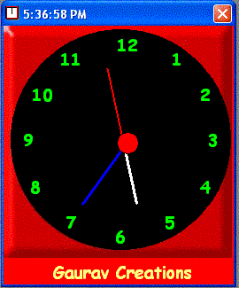



## A Must see Analog Clock with a tiny code

### Description

A must see cool looking analog clock with the smallest code

More features to be added soon.Please Vote and give feedback

Visit www.gauravcreations.com for many more cool programs
 
### More Info
 

             |
---                |---
**Submitted On**   |2002-03-19 17:39:10
**By**             |[Gaurav Creations](https://github.com/Planet-Source-Code/PSCIndex/blob/master/ByAuthor/gaurav-creations.md)
**Level**          |Beginner
**User Rating**    |4.9 (68 globes from 14 users)
**Compatibility**  |VB 6\.0
**Category**       |[Complete Applications](https://github.com/Planet-Source-Code/PSCIndex/blob/master/ByCategory/complete-applications__1-27.md)
**World**          |[Visual Basic](https://github.com/Planet-Source-Code/PSCIndex/blob/master/ByWorld/visual-basic.md)
**Archive File**   |[A\_Must\_see633513192002\.zip](https://github.com/Planet-Source-Code/gaurav-creations-a-must-see-analog-clock-with-a-tiny-code__1-32825/archive/master.zip)

